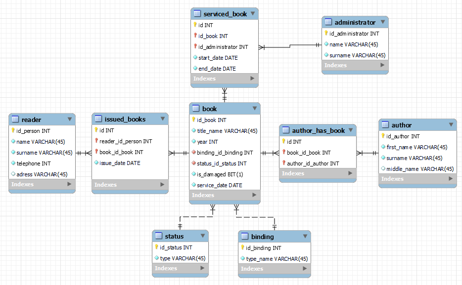

# Общая схема работы

## Запросы

- GET /books - получить список книг
- GET /books?{параметр(-ы) запроса} - получить список книг по определенным параметрам
- GET /persons - получить список всех читателей (только для админов)
- GET /persons?{параметр(-ы) запроса}  - получить список читателей по определенным параметрам (только для админов)

- GET /book/{book_id} - получить данные по книге
- POST /book/ - добавить новую книгу (только для админов)
- PUT /book/{book_id} - изменить данные о книги (только для админов)
- PUT /book/{book_id}?status_id=*номер статуса* - отправить книгу на обслуживание
- DELETE /book/{book_id} - удалить данные о книге (только для админов)

- GET /author/{author_id} - получить данные по автору
- POST /author/ - добавить нового автора (только для админов)
- PUT /author/{author_id} - изменить данные об авторе (только для админов)
- DELETE /author/{author_id} - удалить данные об авторе (только для админов)

- GET /person/{person_id} - получить данные по читателю (только для админов)
- POST /person/ - добавить нового читателя (только для админов)
- PUT /person/{person_id} - изменить данные о читателе (только для админов)
- DELETE /person/{person_id} - удалить данные о читателе (только для админов)

## Как работает отправление книги на обслуживание:

С помощью шедулера (планировщика задач) проводится периодическая проверка - есть ли книги, которым требуется обслуживание. Значение периода записано в конфигураторе.  Если такие имеются, то для таких книг меняется их статус:

- “Выдан (требуется обслуживание)” - если книга находится у читателя
- “Ожидает обслуживание” - если книга находится в библиотеке и пока никто из администраторов ее не взял на обслуживание

Из списка книг со статусом “Ожидает обслуживание” администратор берет некоторый список книг, после чего у этих книг меняется статус “в обслуживании”, в журнале обслуживания системой делается запись, что конкретный администратор взял конкретный список книг с датой начала обслуживания.

По завершению обслуживания, администратор меняет статус книг на “в наличии” и система фиксирует для данных книг дату окончания обслуживания, а также в зависимости от года издания и переплета книги выставляет дату следующего обслуживания.

## Схема БД

